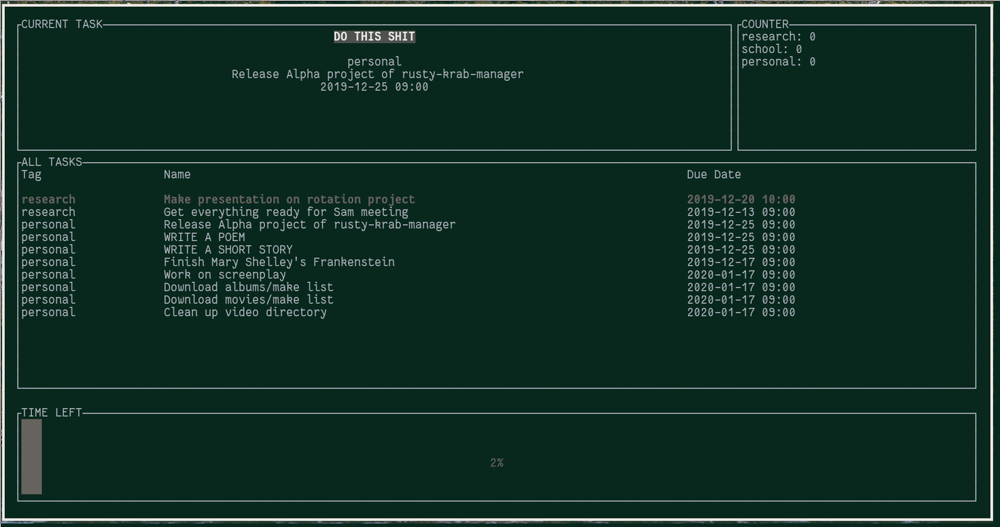

<h1 align="center"> rusty-krab-manager </h1>

  
  
  

<h3 align="center"></h3>

 🕰️ - let spongebob manage your time 

The rusty-krab-manager is a terminal user interface written in Rust designed to facilitate task management with inspiration from the pomodoro technique developed by Francesco Cirillo. [See it in action here!](https://www.reddit.com/r/unixporn/comments/isqa9v/oc_task_management_tui_written_in_rust_using_the/)

### More: \[[Installation](https://github.com/aryakaul/rusty-krab-manager/wiki/Installation)\] \[[Configuration](https://github.com/aryakaul/rusty-krab-manager/wiki/Configuration)\] \[[Usage](https://github.com/aryakaul/rusty-krab-manager/wiki/Usage)\] \[[FAQ](https://github.com/aryakaul/rusty-krab-manager/wiki/FAQ)\]

Note: This was my first experience coding in Rust so it is extremely likely there are things that could be done better. As a result, any and all pull requests are welcome!

BIG THANKS to [tui-rs](https://github.com/fdehau/tui-rs)
